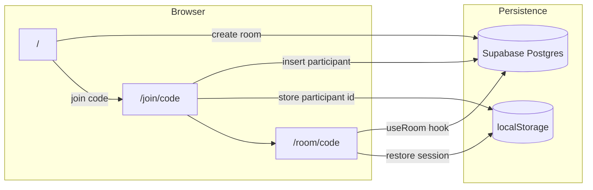
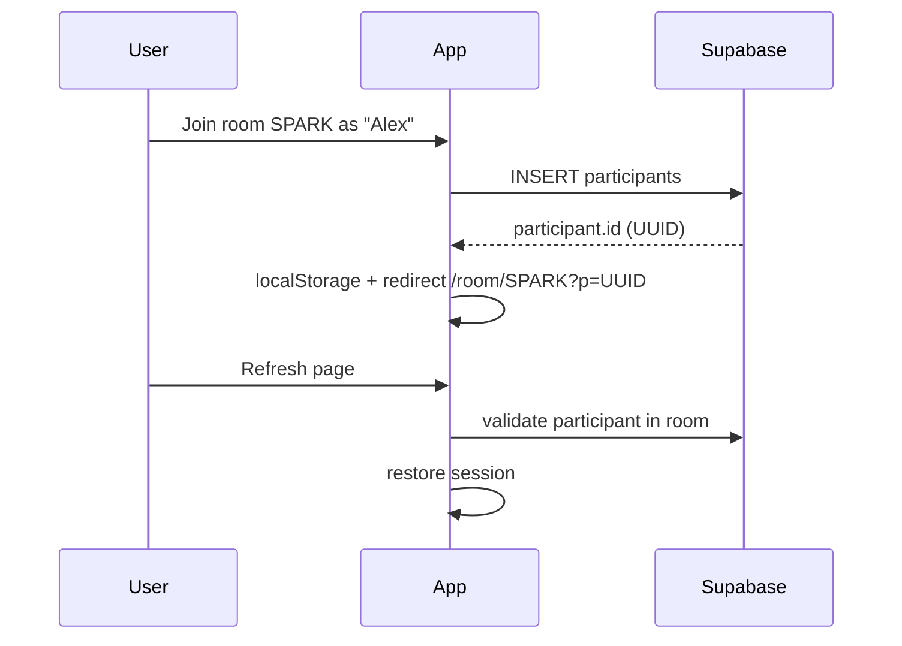
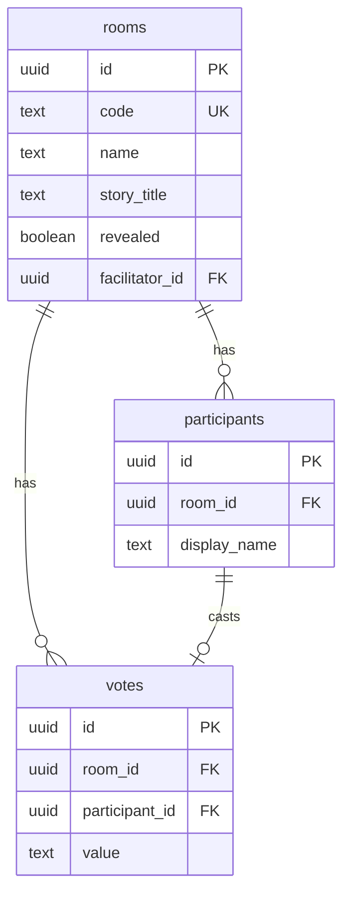

# Architecture overview

## High-level flow

## Routes

| Route | Component | Purpose |
|-------|-----------|---------|
| `/` | `landing-page.tsx` | Create room or enter join code |
| `/join/[code]` | `join-room-form.tsx` | Display name → insert `participants` row |
| `/room/[code]` | `room-page-client.tsx` → `room-view.tsx` | Live voting UI |

## Session model (no auth)

There is no login. Identity is a UUID participant row plus client storage:

1. **Create / join** — Supabase inserts a `participants` row; app stores `{ participantId, roomCode, displayName }` in `localStorage`.
2. **Room URL** — `/room/SPARK?p=<participantId>` lets refresh and share links restore the same participant.
3. **Host** — `rooms.facilitator_id` points at the creator's participant id. Host can reveal, reset, edit story title and room name. If the host leaves, the next participant becomes host.

## Module map

| Path | Role |
|------|------|
| `hooks/use-room.ts` | Room state, Realtime subscription, optimistic mutations |
| `lib/room-actions.ts` | Supabase reads/writes (create, join, vote, reveal, leave) |
| `lib/supabase/client.ts` | Browser Supabase singleton |
| `lib/participant-storage.ts` | `localStorage` helpers |
| `components/room/room-view.tsx` | Main room UI, wires `useRoom` + keyboard shortcuts |
| `supabase/schema.sql` | Tables, RLS, Realtime publication |

## Database tables

## Further reading

- [Realtime sync](./realtime-sync.md) — WebSocket events, refetch strategy, optimistic UI
