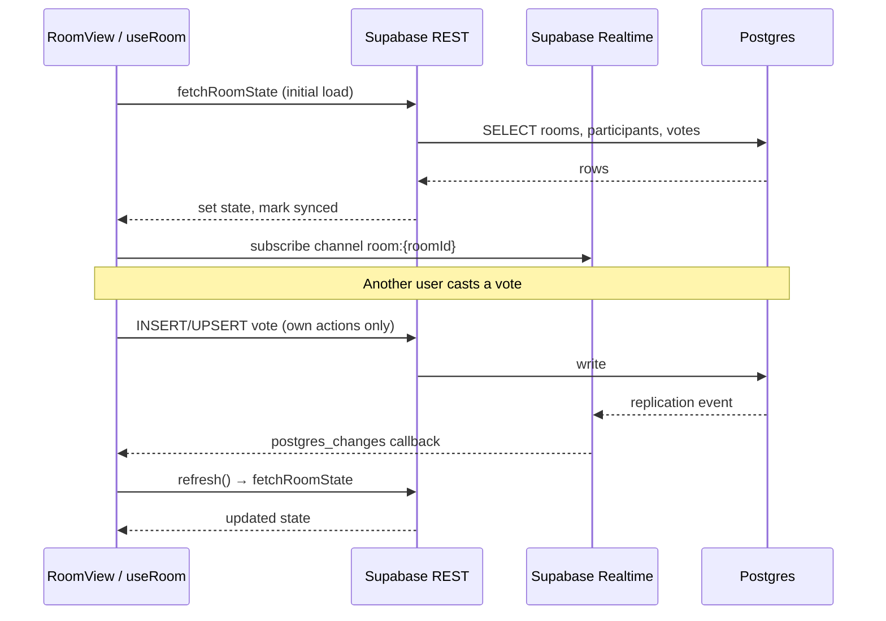
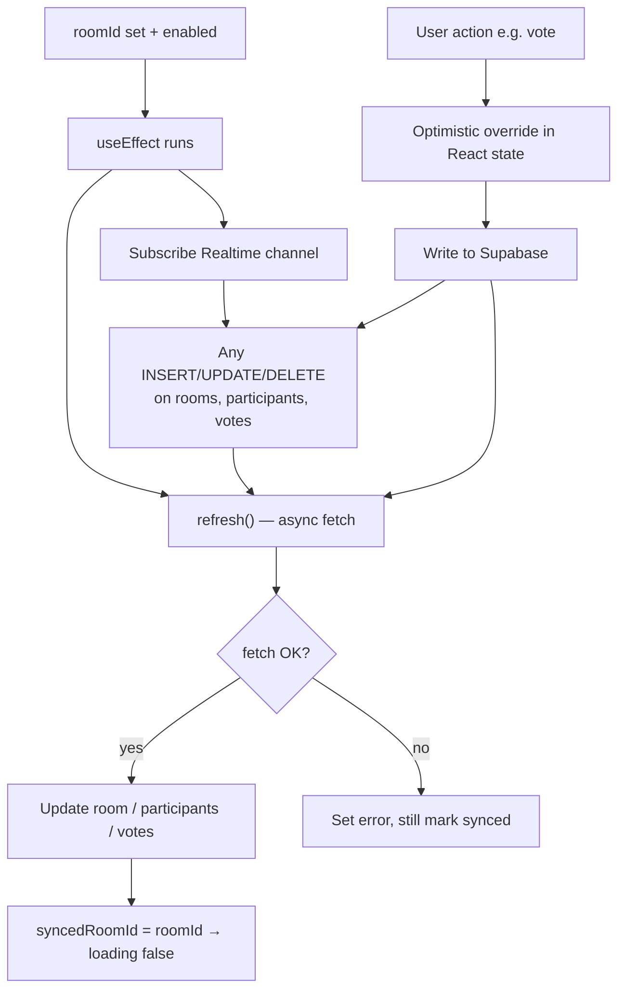
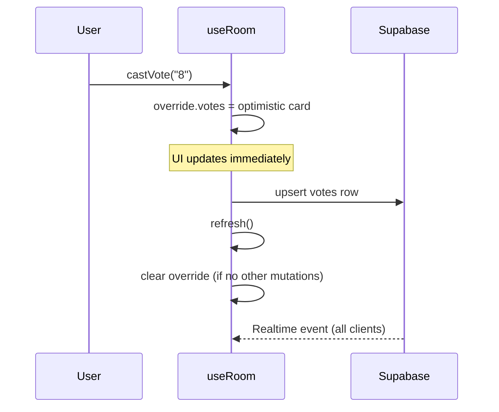

# Realtime sync

Sprint Poker does **not** poll the database. Live updates use **Supabase Realtime** (WebSocket) to listen for Postgres changes, then **refetch** the full room state over REST.

## Summary

| Question | Answer |
|----------|--------|
| Polling (`setInterval`)? | **No** |
| WebSocket push? | **Yes** — `postgres_changes` on `rooms`, `participants`, `votes` |
| Apply event payload directly? | **No** — event triggers `refresh()` → 3 parallel SELECTs |
| Optimistic UI? | **Yes** — local override until mutation + refetch complete |

## End-to-end flow



## `useRoom` lifecycle



### Loading state (no `setState` in effect)

`loading` is **derived**, not toggled inside the effect:

```
loading = enabled && roomId && syncedRoomId !== roomId
```

When `roomId` changes, `syncedRoomId` still holds the previous room until `refresh()` finishes — so the UI shows loading automatically without calling `setLoading(true)` in the effect (which React 19 lint rules disallow).

### Stale data guard

While `syncedRoomId !== roomId`, the hook returns empty participants/votes and `room: null` so a fast room switch does not flash the previous room's data.

## Realtime subscription (source)

Channel name: `room:{roomId}`. Three listeners, all calling the same `refresh()`:

| Table | Filter |
|-------|--------|
| `rooms` | `id=eq.{roomId}` |
| `participants` | `room_id=eq.{roomId}` |
| `votes` | `room_id=eq.{roomId}` |

Cleanup on unmount or `roomId` change: `supabase.removeChannel(channel)`.

## Optimistic mutations



Host actions (`reveal`, `reset`, `updateStoryTitle`, `updateRoomName`) follow the same pattern with `pending` flags for button spinners.

## Supabase setup requirement

Tables must be in the `supabase_realtime` publication (see `supabase/schema.sql`). Without this, subscriptions connect but **no events fire** — the room only updates after your own writes (post-mutation `refresh()`).

Verify in Supabase Dashboard: **Database → Publications → supabase_realtime** — ensure `rooms`, `participants`, and `votes` are listed.

## Why refetch instead of merging events?

**Pros of current approach**

- Simple and hard to get wrong — always consistent with DB
- One code path for initial load, Realtime, and post-mutation updates
- No manual merge logic per table/event type

**Trade-off**

- Extra read queries on every change (3 SELECTs per event)
- Fine for planning poker room sizes; revisit if rooms grow very large

## Related files

- `hooks/use-room.ts` — subscription + derived loading + optimistic overrides
- `lib/room-actions.ts` — `fetchRoomState`, mutations
- `lib/supabase/client.ts` — browser client singleton
- `supabase/schema.sql` — Realtime publication setup
